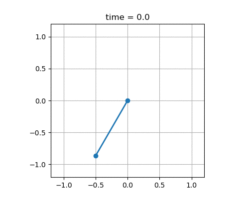

# HW2 - DQN

## What to do

### Algorithms
Your goal is to implement the Deep Q Network (DQN) algorithm for reinforcement learning in a "function approximation" setting. The key difference between DQN and Q-learning (which you implemented in HW1) is that DQN uses a neural network to approximate the Q-function rather than a table. One consequence is that DQN can be applied to systems with a *continuous* state space, while Q-learning can only be applied to systems with a *finite* state space. Note, however, that DQN still requires a finite action space.

DQN is described in the following paper:

> V. Mnih, K. Kavukcuoglu, D. Silver, A. A. Rusu, J. Veness, M. G. Bellemare, A. Graves, M. Riedmiller, A. K. Fidjeland, G. Ostrovski, S. Petersen, C. Beattie, A. Sadik, I. Antonoglou, H. King, D. Kumaran, D. Wierstra, S. Legg, and D. Hassabis (2015) "Human-level control through deep reinforcement learning", Nature 518, 529–533. DOI: [10.1038/nature14236](https://dx.doi.org/10.1038/nature14236).

You can download this paper freely [at its DOI](https://dx.doi.org/10.1038/nature14236) from any computer on the campus network. You can also download this paper through the [university library website](https://library.illinois.edu).

In particular, you will find a derivation of DQN, pseudocode, and details of implementation in the "Methods" section of Mnih et al (2015). You will also find a list of hyperparameter values that were used by the authors in "Extended Data Table 1." You may find that certain details are either missing or need to be changed, so should expect that it may take you some time to figure out exactly what to implement.

### Environments

You will test your algorithms in the following provided environment:
- A simple pendulum with a *continuous* state space and discretized action space, for which an explicit model is not available (e.g., http://underactuated.mit.edu/pend.html). The environment is defined in `discreteaction_pendulum.py`. An example of how to use the environment is provided in `test_discreteaction_pendulum.py`.

Note that we have enabled recording movies of the pendulum this time (see the example code in `test_discreteaction_pendulum.py`):

You should express the reinforcement learning problem as a Markov Decision Process with an infinite time horizon and a discount factor of $\gamma = 0.95$. Please use a neural network with *two* hidden layers that each have 64 units. Please use a `tanh` activation function at both the hidden layers, with a linear activation function at the output layer. You are free to play around with the network architecture, just make sure you present results for this one architecture at least.

### Results

Please apply DQN to the pendulum. More specifically, please write code to generate, at a minimum, the following results:
- A plot of the learning curve for at least one trained agent (return versus the number of episodes or simulation steps).
- A plot of an example trajectory for at least one trained agent.
- An animated gif of an example trajectory for at least one trained agent.
- A plot of the policy for at least one trained agent.
- A plot of the state-value function for at least one trained agent.
- Results for an ablation study, similar to what appears in "Extended Data Table 3" of Mnih et al (2015), under the following conditions:
    - With replay, with target Q (i.e., the standard algorithm).
    - With replay, without target Q (i.e., the target network is reset after each step).
    - Without replay, with target Q (i.e., the size of the replay memory buffer is equal to the size of each minibatch).
    - Without replay, without target Q (i.e., the target network is reset after each step *and* the size of the replay memory buffer is equal to the size of each minibatch).

Your results are likely to vary from one training run to the next. You will be able to draw stronger conclusions from your results if you average your results over several training runs.

Include a `train_discreteaction_pendulum.py` files that can be run to generate all necessary plots and data. The `figures/` directory includes example figures. You are not required to plot results in this manner (and the example figures themselves are not necessarily perfect) - they are simply meant to give a general sense for how you might want to plot things.

## What to submit

### 1. Initial code

Create a [pull request (PR)](https://docs.github.com/en/pull-requests/collaborating-with-pull-requests/proposing-changes-to-your-work-with-pull-requests/about-pull-requests) to enable a [review of your code](#2-code-review). Your code should be functional - that is, each algorithm should be working and ready to be reviewed for improvements. Remember that you need to write your own code from scratch.

Name your PR "Initial hwX for Firstname Lastname (netid)".

**Due: 10am on Thursday, March 30**

### 2. Code review

Review the code of at least one colleague. That is, you should:
- Choose a PR that does not already have a reviewer, and [assign yourself as a reviewer]((https://docs.github.com/en/pull-requests/collaborating-with-pull-requests/reviewing-changes-in-pull-requests/about-pull-request-reviews)).
- Perform a code review. See [Resources](#resources) for guidance on how to perform code reviews (at a minimum, look at Google's best practices).
- Modify your `README.md` file to specify whose code you reviewed (using their GitHub username).

The goal of this review process is to arrive at a version of your code that is functional, reasonably efficient, and easy for others to understand. The goal is *not* to make all of our code the same (there are many different ways of doing things). The goal is also *not* to grade the work of your colleagues - your reviews will have no impact on others' grades. Don't forget to remind your colleagues to do the simple things like name their PR and training file correctly!

**Due: 10am on Sunday, April 2**

### 3. Final code and results

Improve your own code based on reviews that you receive. **Respond to every comment and merge your PR.** If you address a comment fully (e.g., by changing your code), you mark it as resolved. If you disagree with or remain uncertain about a comment, engage in follow-up discussion with the reviewer on GitHub. Don't forget to reply to follow-ups on code you reviewed as well.

Submit your repository, containing your final code and a (very brief) report titled `hwX-netid.pdf`, to [Gradescope](https://uiuc-ae598-rl-2023-spring.github.io/resources/assignments/). The report should be formatted using either typical IEEE or AIAA conference/journal paper format and include the following, at a minimum:
- Plots discussed in [Results](#results).
- An introduction (e.g., discussion of the problem(s)), discussion of methods (e.g., including any specific details needed to understand your algorithm implementations like hyperparameters chosen), discussion of results, and general conclusions.

**Due: 10am on Tuesday, April 4**

## Resources
Here are some resources that may be helpful:
* Google's [best practices for code review](https://google.github.io/eng-practices/review/reviewer/looking-for.html)
* A Microsoft [blog post on code review](https://devblogs.microsoft.com/appcenter/how-the-visual-studio-mobile-center-team-does-code-review/) and [study of the review process](https://www.microsoft.com/en-us/research/wp-content/uploads/2016/05/MS-Code-Review-Tech-Report-MSR-TR-2016-27.pdf)
* A RedHat [blog post on python-specific code review](https://access.redhat.com/blogs/766093/posts/2802001)
* A classic reference on writing code: [The Art of Readable Code (Boswell and Foucher, O'Reilly, 2012)](https://mcusoft.files.wordpress.com/2015/04/the-art-of-readable-code.pdf)

Many other resources are out there - we will happily accept a PR to add more to this list!
